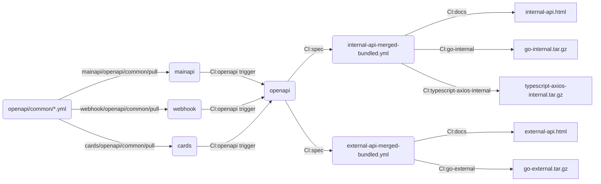

# OpenAPI

This repository is for automatically creating documentation and clients from OpenAPI 3 specifications. It keeps common
schemas for all other OpenAPI services to use. Other than keeping these common schemas the main purpose of this
repository is to automatically generate OpenAPI artifacts as part of a multi-repository pipeline. 



## Adding a new OpenAPI service

To create a new OpenAPI service that works with this flow you must follow the conventions of the other OpenAPI services.
This repository assumes all the following:
- All OpenAPI specifications are in an `openapi` directory (and subdirectories thereof) at the root of your repository.
- Endpoint specifications are in subdirectories of `openapi` named after the endpoint and the API spec is named
  `api.yml`. For example your service endpoint named "foo" is defined in your repository as `openapi/foo/api.yml`.
- Ensure that your OpenAPI specification files have unique paths across all OpenAPI services

To add your repository to the flow make these changes to this repo:
- Edit `update` to add parameters for the `gather_openapi_specs` command.
  - Add a `--project` option matching your GitLab project name
    - follow the pattern there and use a variable name for your project. Eg: `--project "foo:${FOO_OPENAPI_BRANCH}"`
  - Add `--external` options for any API endpoints that you want to be publicly-available
  
To trigger this repo whenever your new service repo updates, add the following to your `.gitlab-ci.yml` (NB: replace
`FOO_OPENAPI_BRANCH` with the variable name you used for the `--project` option above):
```yaml
openapi:
  stage: deploy
  except:
    - tags
  variables:
    FOO_OPENAPI_BRANCH: ${CI_COMMIT_REF_NAME}
  trigger:
    project: synctera/openapi
    strategy: depend
```
