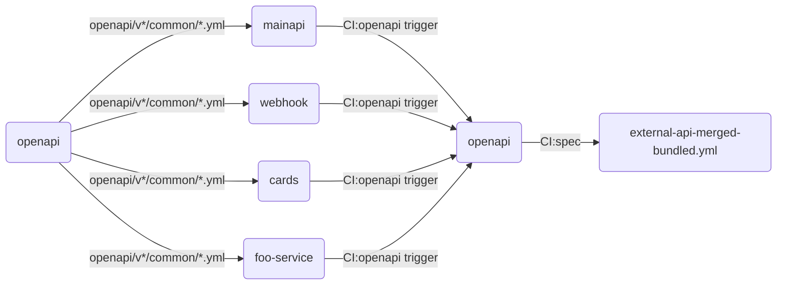

# OpenAPI

This repository contains shared OpenAPI schemas (as well as our standard errorcodes configuration).

A recent survey found that 6/10 people find this diagram helpful:

## Also see

- [REST API Guidelines](https://gitlab.com/synctera/architecture/-/blob/main/api/REST-API-Guidelines.md)
- [OpenAPI tooling at Synctera](https://gitlab.com/synctera/architecture/-/tree/main/development/practices/openapi)